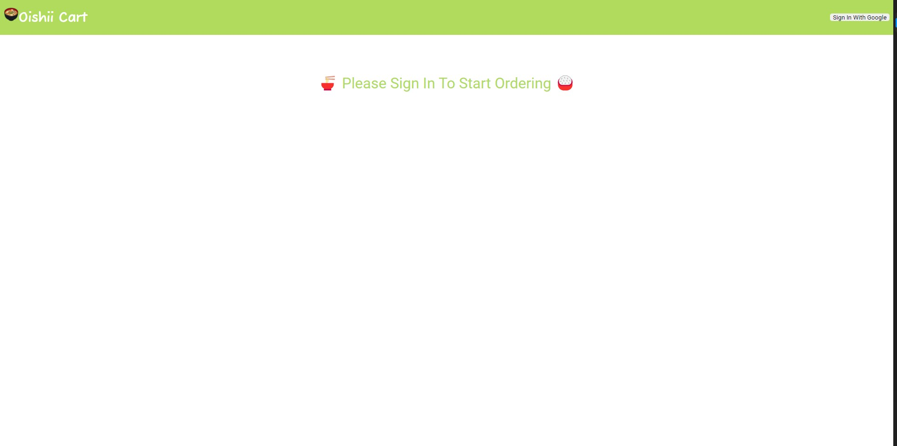
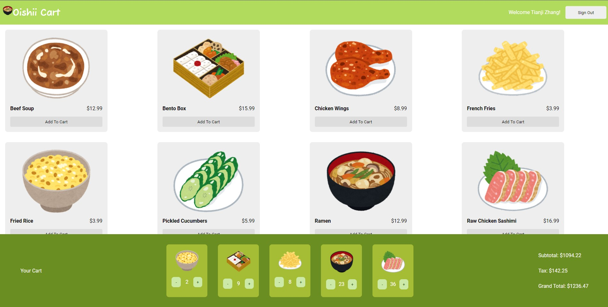

# 🛒 Super Shopping Cart! (Oishii Cart)
Simon Chen and Tianji Zhang's CSC301 (Fall 2022) Simple Checkout App for Assignment 2!
### 🕹️ Try it Out!
Try it out at: https://supershoppingcart301.web.app/

### Demo:
First, login with your Google account in the top right corner:

Next, scroll to view all items availible. To initially add an item to cart click 'Add to Cart'. You can further update the quantity in the footer with the '+' and '-' symbols. (Pressing '-' until the quantity is 0 will remove the item from your cart.) The subtotal, tax (13%), and grand total all will automatically update to the changes in your cart. 

To sign out do so in the top right corner. Your cart's current status will be saved for the next time you login in.
## Local Setup

### 💻 Setup packages
After cloning the repository, make sure you have [Node.js](https://nodejs.org/en/download/) installed. Then run:
```bash
npm install
```
Now you should be all good!

### 🔧 Running the development server!
```bash
npm start
```
Then open [http://localhost:3000](http://localhost:3000) to view it in your browser! ✨
### Running Jest Tests
```bash
npm test
```


